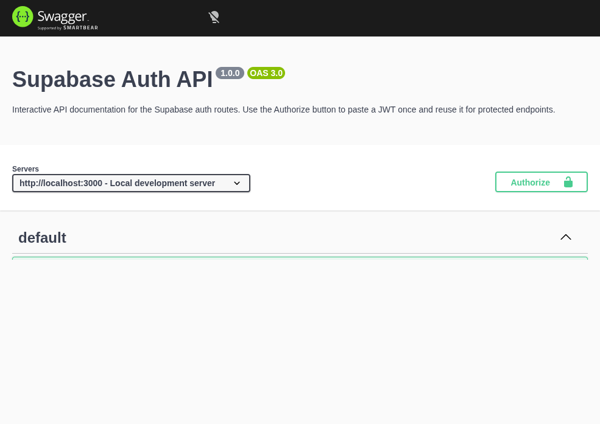

# Supabase Auth API

A small Express and Supabase authentication service with public and protected endpoints, plus Swagger UI documentation at `/docs`.

## What this project is

This project exposes a simple auth API for:

- creating users
- logging in and receiving tokens
- logging out
- reading a public endpoint
- reading a protected profile endpoint

Swagger UI is available at `/docs`, and the generated OpenAPI document is served at `/openapi.json`.

## Environment variables

Copy the example file and fill in your values:

```bash
cp .env.example .env
```

Required variables:

- `PORT` - port the API listens on. Defaults to `3000` if omitted.
- `SUPABASE_URL` - your Supabase project URL.
- `SUPABASE_KEY` - your Supabase anon or service key, depending on how you want to run the API.

Example `.env` file:

```bash
PORT=3000
SUPABASE_URL=https://your-project.supabase.co
SUPABASE_KEY=your-supabase-key
```

## Run it

```bash
npm run dev
```

## API reference

| Method | Path | Auth required | Description |
| --- | --- | --- | --- |
| POST | `/api/auth/signup` | No | Create a new user account. |
| POST | `/api/auth/login` | No | Log in and return access and refresh tokens. |
| POST | `/api/auth/logout` | Yes | Sign out the current authenticated user. |
| GET | `/api/public/info` | No | Return a public sample response. |
| GET | `/api/protected/profile` | Yes | Return the authenticated user profile. |

## Swagger UI

The screenshot below shows the interactive Swagger UI with the Authorize button and protected endpoints marked with the lock icon.


